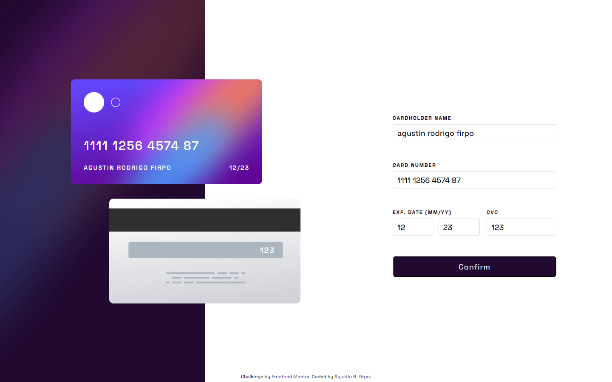
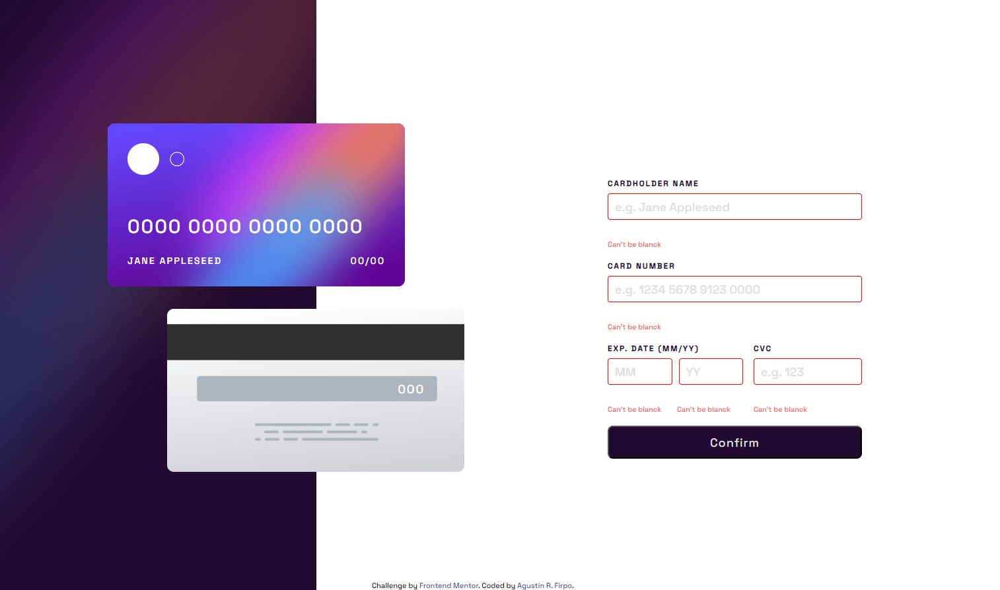
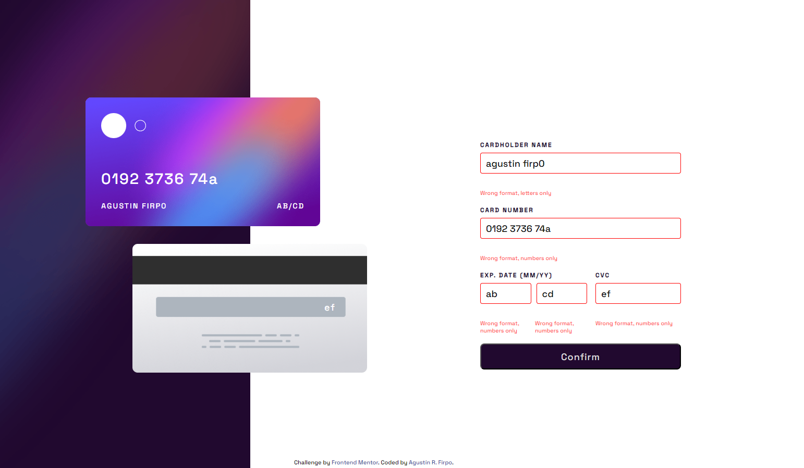
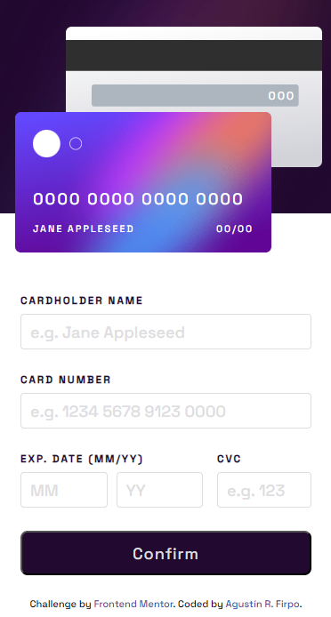
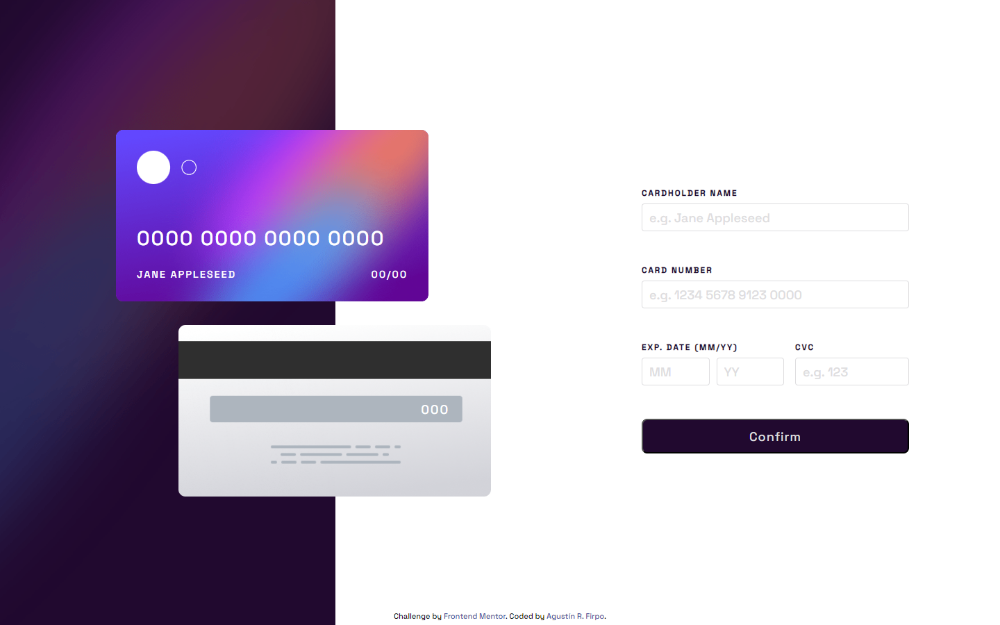
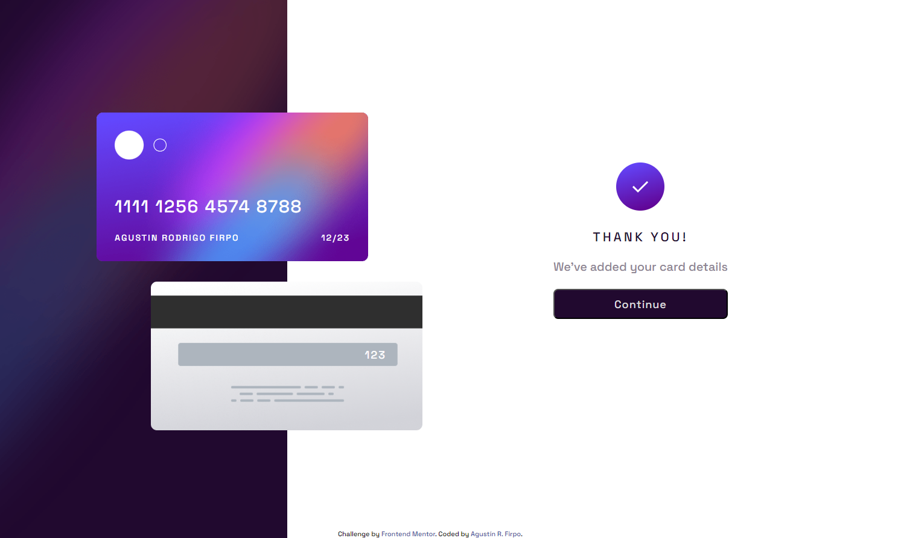

Hi everybody! 👋

# Frontend Mentor - Interactive card details form solution

This is a solution to the [Interactive card details form challenge on Frontend Mentor](https://www.frontendmentor.io/challenges/interactive-card-details-form-XpS8cKZDWw).

## Table of contents  🧾

- [Overview](#overview)
  - [The challenge](#the-challenge)
  - [Links](#links)
- [My process](#my-process)
  - [Built with](#built-with)
  - [What I learned](#what-i-learned)
  - [Continued development](#continued-development)
- [Author](#author)

## Overview

### The challenge  🎯

Users should be able to:

- Fill in the form and see the card details update in real-time

- Receive error messages when the form is submitted if:

- Any input field is empty

  - The card number, expiry date, or CVC fields are in the wrong format

- View the optimal layout depending on their device's screen size:
  
  - Mobile Design

  - Desktop Design
  

  - Desktop Confirmation Design

- See hover, active, and focus states for interactive elements on the page

### Links 🔗

- Solution: [Github Repository](https://github.com/Arfirpo/interactive-card-details-form-main)
- Solution: [Github Page](https://arfirpo.github.io/interactive-card-details-form-main/)

## My process ⚙️

### Built with 🛠️

- Semantic HTML5 markup
- CSS custom properties
- Flexbox
- [Sass](https://sass-lang.com/) - Css preprocessor
- Mobile-first workflow

### What I learned 📚

This challenge allowed me to consolidate and expand my knowledge in javascript, especially in:
-Management of events.
-Functions of validation.
-Creation of regular expressions.
-Manipulation of the DOM.

In turn, this was the first project using SASS to style my html, getting into the use of:
-Nestings
-Partial
-Mixins
-Extends

### Continued development 🔨

In relation to sass, I want to consolidate the management of its syntax and the advantages it offers compared to simple css style sheets.
As for javascript, I want to address more challenges related to form validations, to finish learning how it works.

## Author 🙋🏻‍♂️

- Twitter/X - [@agus_firpo](https://twitter.com/agus_firpo)
- Frontend Mentor - [@Arfirpo](https://www.frontendmentor.io/profile/Arfirpo)
- Linkedin - [Agustín Rodrigo Firpo](https://www.linkedin.com/in/agustin-rodrigo-firpo-0aa86697/)